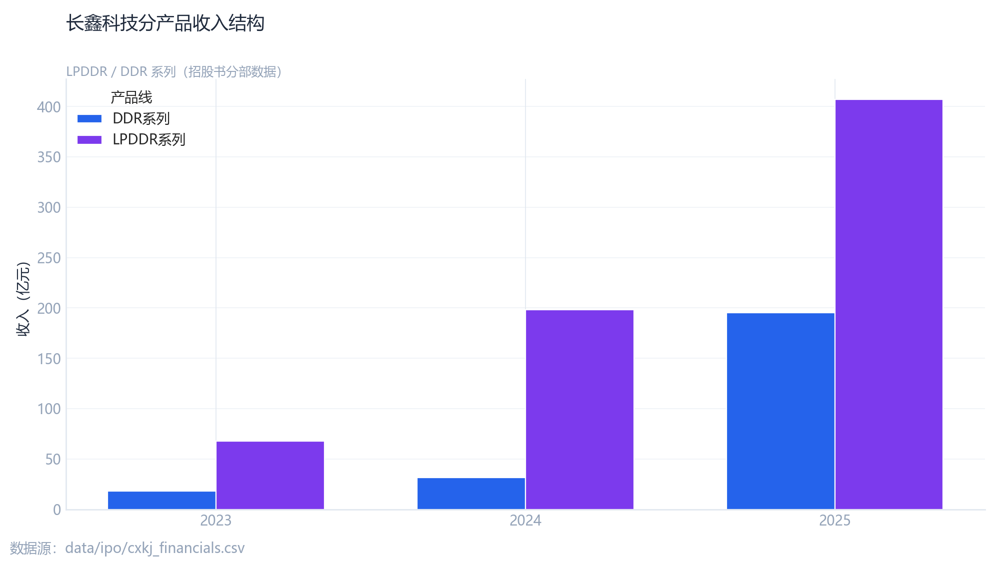
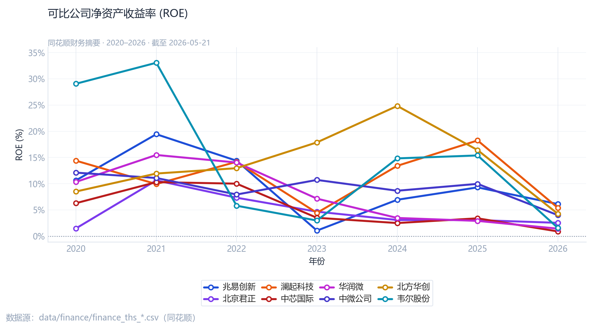

# 财务事实与产品结构 {#sec-ch04}

## 规模与盈利轨迹

招股书及更新披露显示，长鑫处于 **收入快速扩张、归母净利润仍为负** 的阶段。核心数字（亿元，四舍五入）：

| 指标 | 2022 | 2023 | 2024 | 2025 | 2026Q1 |
|------|------|------|------|------|--------|
| 营业收入 | 82.9 | 146.2 | 241.8 | 618.0 | 508.0 |
| 归母净利润 | 亏损 | 亏损 | 亏损 | +18.7 | 亏损 |

::: {.callout-warning}
## 口径说明

上表以 `data/ipo/cxkj_financials.csv` 为准；2025 全年与 2026Q1 为披露更新口径，与早期申报稿可能存在修订，请以最新 PDF 核对。
:::

## 营收增长可视化

```{r}
#| label: fig-revenue
#| fig-cap: "长鑫科技营业收入与同比增速（招股书口径）"
#| echo: false
#| eval: false
```

{#fig-revenue-alt width=90% fig-alt="营收与利润趋势"}

若 `images/` 中尚无该文件，请先运行上级 `DS/scripts/analysis.py` 并执行 `scripts/sync_images.ps1`（见附录）。

## 产品结构：LPDDR vs DDR

2025 年上半年，**LPDDR** 收入规模高于 **DDR**（约 106 亿 vs 42 亿量级），反映移动端与消费电子需求占比较高。

{#fig-product width=85% fig-alt="产品结构"}

## 同业 ROE 对照

存储产业链设备/制造龙头在 2024 年 ROE 多为正值，而长鑫仍处投入期。下图展示可比公司 ROE 轨迹（图例置底，避免遮挡曲线）。

{#fig-roe width=90% fig-alt="同业ROE"}

## 全球营收对照

将长鑫营收路径与美光（MU）等全球龙头对照，有助于理解 **规模差距** 与 **周期位置**（非因果推断）。

{#fig-mu width=90% fig-alt="长鑫与美光营收"}

## 本章小结

1. **规模**：营收 2022→2024 由约 83 亿增至约 242 亿，2025 进一步放量；
2. **盈利**：归母净利 2025 年出现正值信号，但累计亏损仍大（招股书累计口径约 **409 亿** 量级）；
3. **结构**：LPDDR 占比提升，与下游手机/平板景气相关。

下一章在此基础上讨论估值走廊与模型锚。
