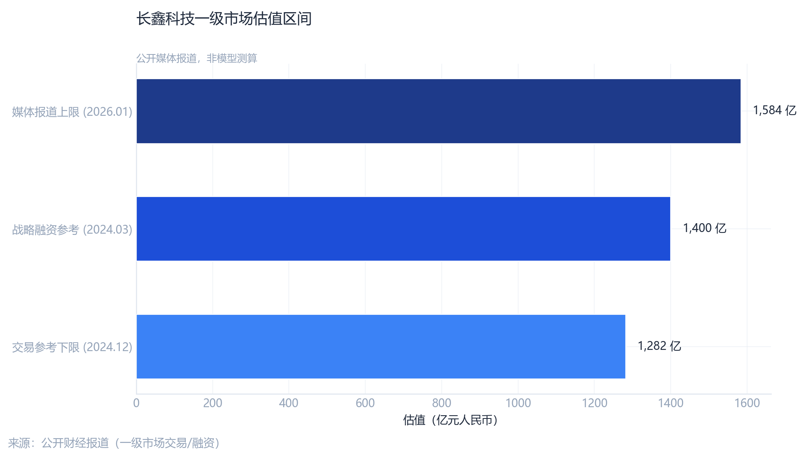

# 估值走廊与交叉验证 {#sec-ch05}

## 一级市场走廊

公开报道的一级市场估值约 **1,282—1,584 亿元**，以 2024 年营收 **241.8 亿元** 换算，隐含 **PS 约 5.3—6.6 倍**。该区间反映 Pre-IPO 博弈与战略投资者定价，**不能**直接等同于上市后连续竞价中枢。

{#fig-val-range width=88% fig-alt="估值走廊"}

## 收入×PE 情景（示意）

在缺乏稳定盈利预测时，可用 **收入×PE** 做敏感性示意（须与 PS 分开解读）：

| 假设 PE | 示意市值（亿元） | 备注 |
|---------|------------------|------|
| 8× | ~1,934 | 偏保守盈利预期 |
| 15× | ~3,627 | 中等修复情景 |
| 25× | ~6,045 | 乐观情景 |

上述 PE 作用于收入口径仅为 **教学式情景**，需未来净利润预测方可与 DCF/PE 估值接轨。

## 同业 PS 回归隐含市值

`advanced_analysis.py` 在可比公司 **ln(收入)—ln(PS)** 关系下，对长鑫 2024 收入做点估计：

| 字段 | 数值 |
|------|------|
| 2024 营收（亿元） | 241.78 |
| 模型隐含市值（亿元） | **1,635.8** |
| 隐含 PS | 6.77 |
| 模型 R² | 0.08 |

::: {.callout-important}
## 解读

R² 较低说明同业 PS 对收入的线性解释力有限；**1,636 亿** 应视为回归锚，须与一级走廊 **1,282—1,584 亿** 及盈利质量一并讨论。
:::

{#fig-ps width=90% fig-alt="PS回归"}

## 营收 OLS 外推

收入时间序列的 OLS 拟合与 95% 置信带见下图；外推段对周期均值回归敏感，仅作 **路径参考**。

{#fig-forecast width=90% fig-alt="营收预测"}

## 本章小结

- **走廊**：媒体报道 1,282—1,584 亿为一级定价锚；
- **回归**：同业 PS 模型隐含约 **1,636 亿**，与走廊上沿接近但统计拟合弱；
- **情景**：收入×PE 给出宽区间，依赖盈利转正假设。

第六章进入 CAPM、事件研究与净利—营收回归等量化验证。
