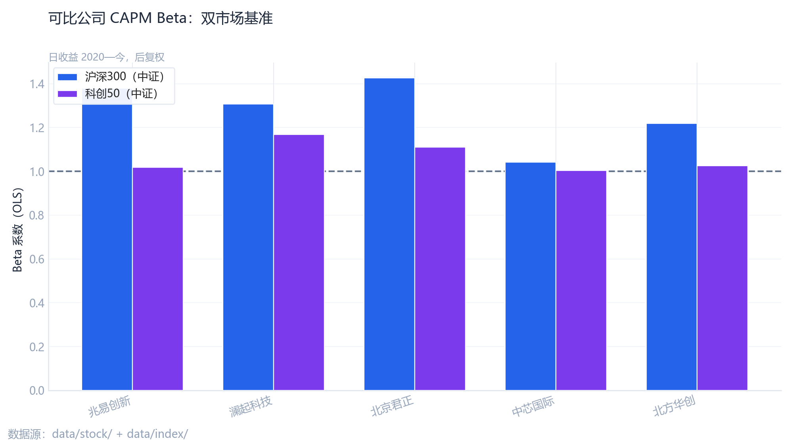
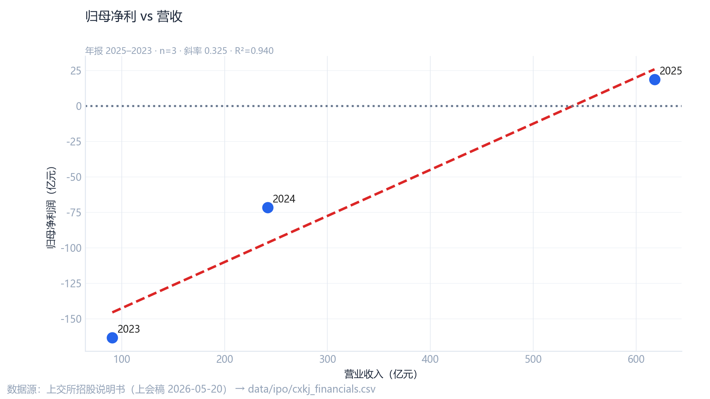

# 进阶量化分析 {#sec-ch06}

## CAPM：系统性风险

以沪深300 为市场基准，估计存储产业链可比公司 Beta（见 `output/capm_results.csv`）。典型结果：

| 公司 | Beta | R² |
|------|------|-----|
| 兆易创新 | 1.38 | 0.24 |
| 澜起科技 | 1.31 | 0.21 |
| 北京君正 | 1.43 | 0.21 |
| 中芯国际 | 1.04 | 0.19 |
| 北方华创 | 1.22 | 0.20 |

**结论**：多数标的 Beta **显著大于 1**，板块波动高于大盘；科创50 双基准对比见下图。

{#fig-capm width=90% fig-alt="CAPM Beta"}

## 事件研究

事件窗设定为 IPO 相关公告日前后 **±20 个交易日**，市场模型基准为沪深300。主要事件包括：

1. 科创板 IPO **受理**（上交所，2025-12-30）；
2. **辅导工作完成**（安徽证监局备案）。

CAR 四曲线合于单图（半导体指数、存储同业等权 × 两事件），便于比较消息是否已被定价。

{#fig-event width=90% fig-alt="事件研究CAR"}

若事件窗平均 AR 的 **p 值 > 0.05**，则异常收益在常规显著性水平下 **不显著**，提示消息或已部分预期。

## 净利—营收回归

归母净利润对营收的回归解释力有限（样本为招股书年报点），不宜外推为盈利预测模型。

{#fig-profit width=85% fig-alt="净利营收回归"}

## 数据表引用

本书 `data/` 目录提供小型结果表副本，完整 CSV 见 `DS/output/`：

- `capm_results.csv`
- `event_study_summary.csv`（或同级事件研究输出）
- `revenue_forecast_ols_ci.csv`

## 本章小结

| 模块 | 发现 |
|------|------|
| CAPM | 高 Beta，上市后波动可能放大 |
| 事件研究 | 受理窗 CAR 对指数温和，统计显著性偏弱 |
| 收入预测 | OLS 路径向上，需结合 DRAM 价格周期修正 |
