# 图表索引

以下图表由 `DS/scripts/analysis.py` 与 `advanced_analysis.py` 基于网络下载数据生成，图源见 [第7节数据溯源](07_section7_data_sources.html)。

## 核心财务与估值

### 图 1 长鑫营收与归母净利润

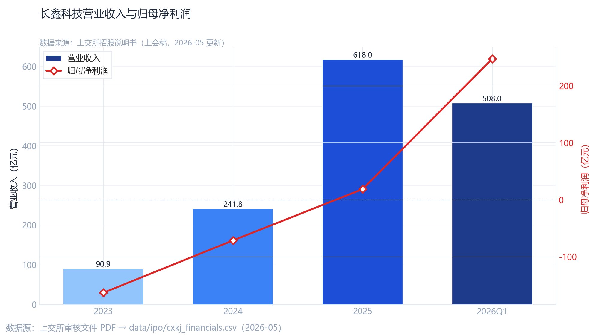{fig-alt="长鑫科技营业收入与归母净利润" width=90%}

### 图 2 产品结构（DDR / LPDDR）

{fig-alt="DDR与LPDDR收入构成" width=90%}

### 图 6 一级市场估值区间（报道口径）

{fig-alt="一级市场报道估值区间" width=90%}

## 同业与市场对照

### 图 3 可比公司股价归一化

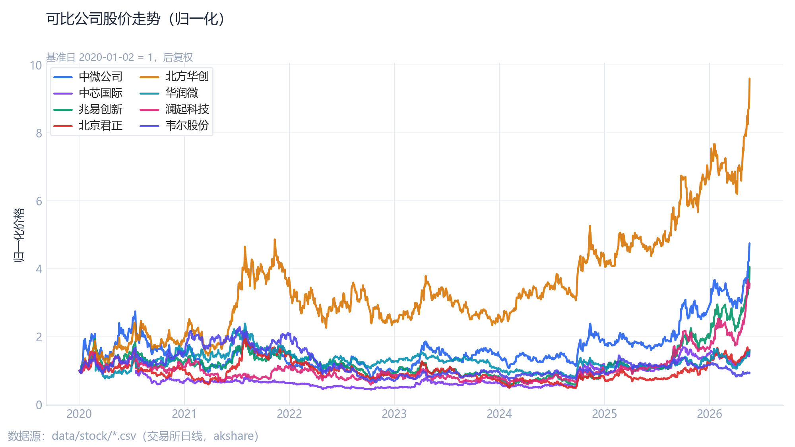{fig-alt="可比公司股价归一化走势" width=90%}

### 图 4 美光 vs A 股半导体指数

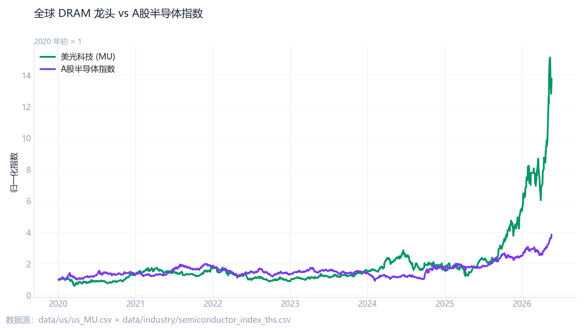{fig-alt="美光与半导体指数对照" width=90%}

### 图 5 同业 ROE

{fig-alt="可比公司净资产收益率" width=90%}

## 第7节：回归、事件研究与预测

### CAPM Beta（双基准）

{fig-alt="双基准Beta估计" width=90%}

### CAPM 散点（兆易创新示例）

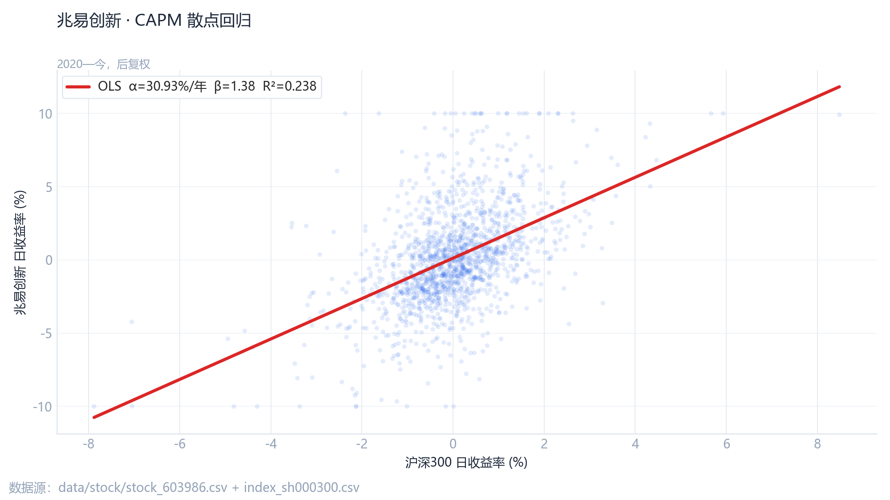{fig-alt="CAPM散点OLS" width=90%}

### 事件研究 CAR

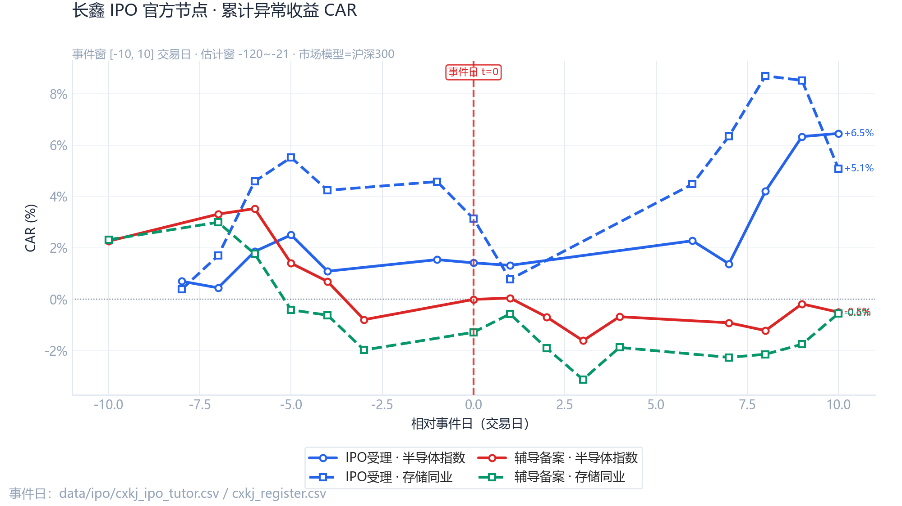{fig-alt="事件研究累计异常收益" width=90%}

### 营收 OLS 预测与置信区间

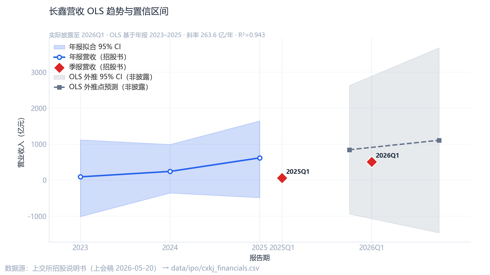{fig-alt="营收OLS外推" width=90%}

### 归母净利—营收回归

{fig-alt="净利营收回归" width=90%}

### 同业 PS 对数回归隐含市值

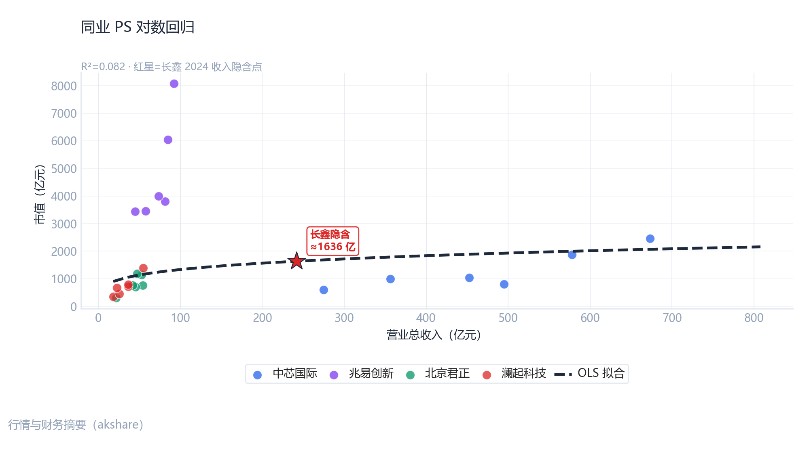{fig-alt="PS对数回归" width=90%}

### 事件窗末端 CAR

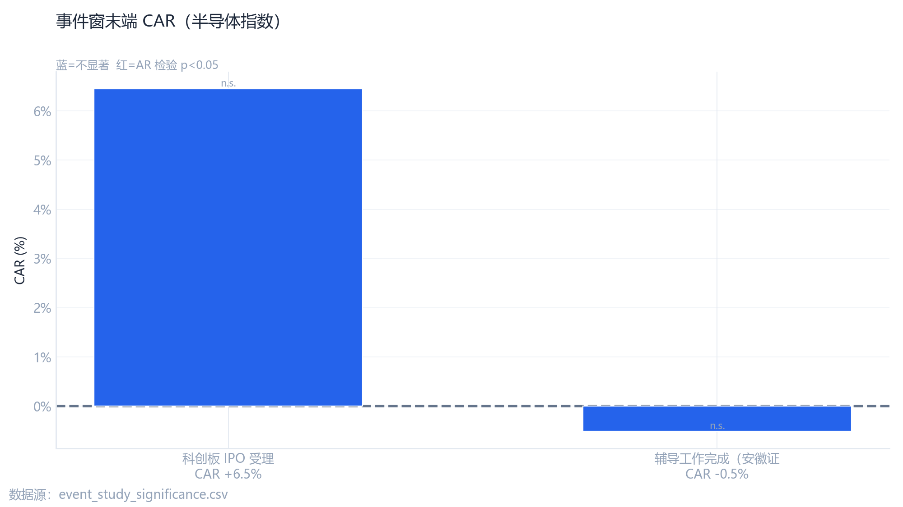{fig-alt="事件窗末端CAR" width=90%}

## 补充图表

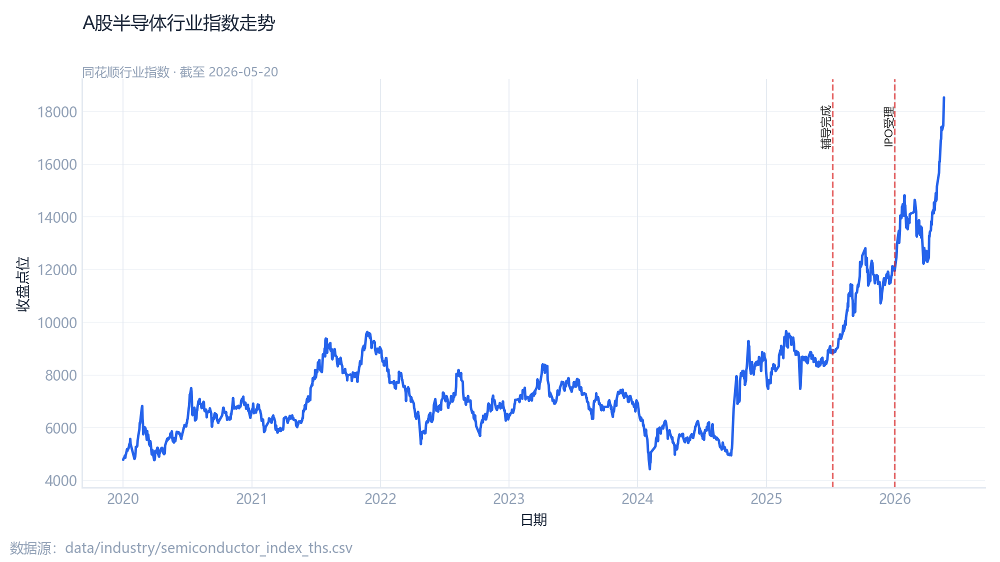{fig-alt="半导体指数走势" width=90%}

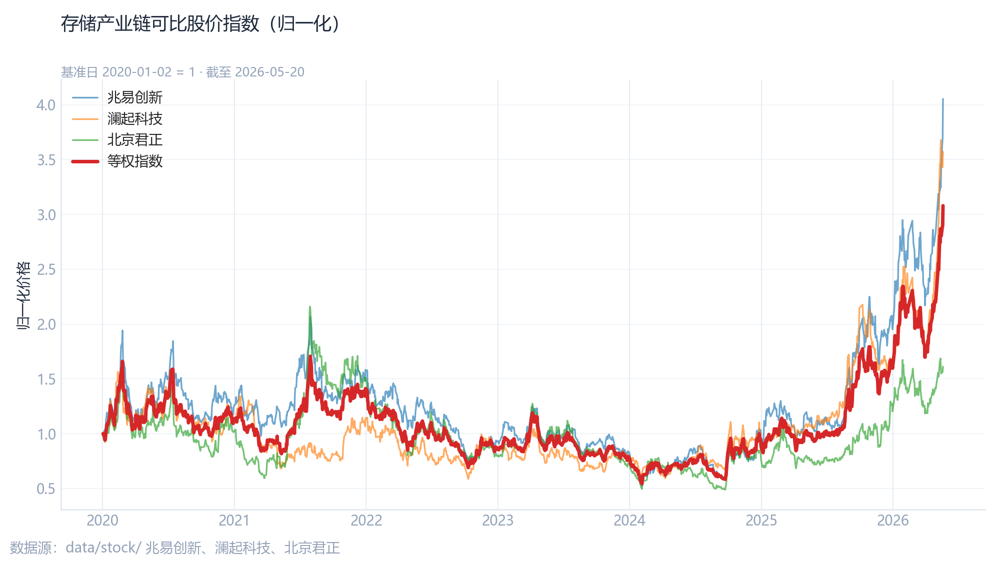{fig-alt="存储同业走势" width=90%}

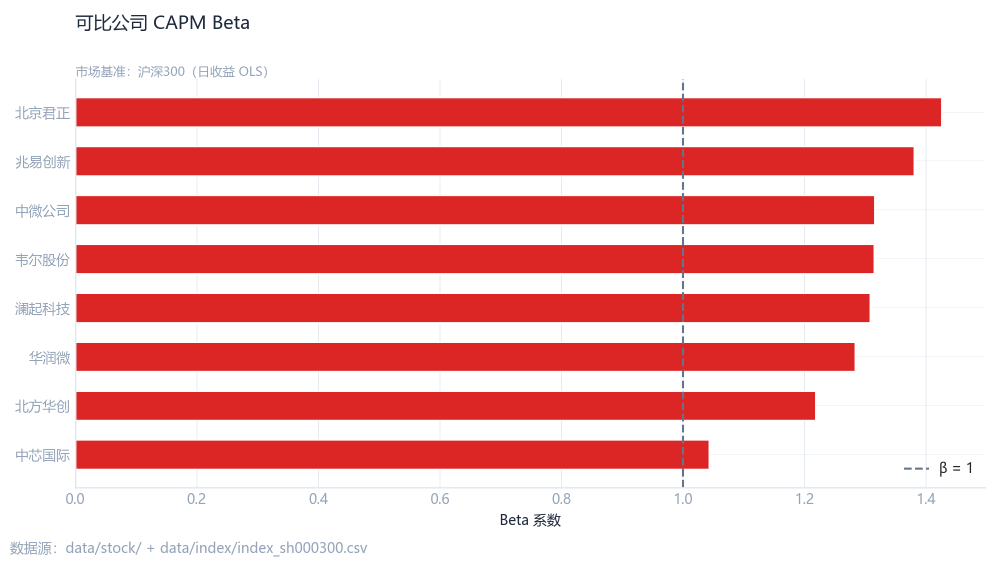{fig-alt="CAPM Beta条形图" width=90%}

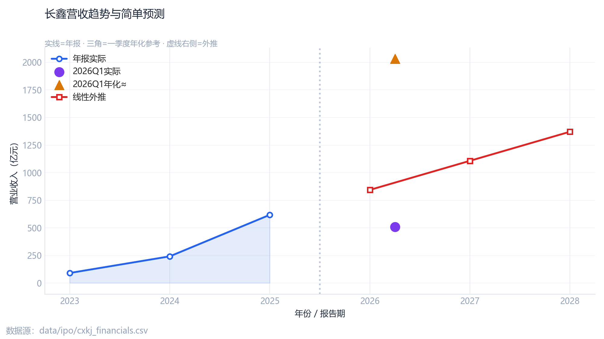{fig-alt="收入预测示意" width=90%}
